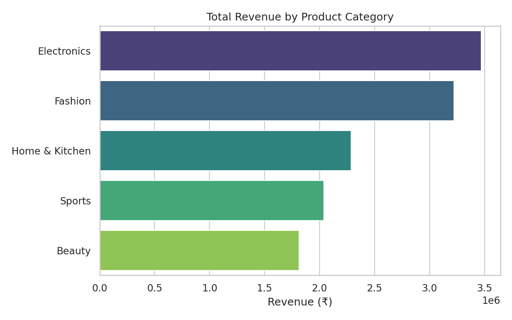
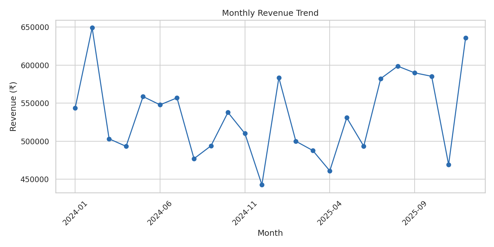

# E-commerce Sales & Customer Analytics

An end-to-end data analysis project: cleaning a messy raw orders export, exploring revenue and customer behavior patterns, and answering business questions using both **Python** and **SQL**.

## Business Questions Answered

- Which product categories and regions drive the most revenue?
- How does revenue trend month over month?
- Who are the highest-value customers?
- Does delivery speed relate to customer satisfaction (rating)?
- Which products are expensive but under-performing on ratings?

## Key Insights

- **Total revenue:** ₹1.28 crore across ~3,000 orders (avg order value ≈ ₹4,284)
- **Top category:** Electronics, followed closely by Fashion
- **Top region:** East
- **Average rating:** 4.04 / 5
- **Delivery speed vs. rating:** no meaningful relationship found in this dataset — a reminder to test assumptions rather than assume them
- Full breakdown in [`cleaning_log.txt`](cleaning_log.txt)

## Files in This Repository

| File | Purpose |
|---|---|
| `ecommerce_orders_raw.csv` | Raw, intentionally messy export |
| `ecommerce_orders_clean.csv` | Cleaned dataset |
| `ecommerce.db` | SQLite DB of the cleaned data |
| `cleaning_log.txt` | Step-by-step cleaning log + insights |
| `ecommerce_analysis.ipynb` | Interactive notebook walkthrough |
| `generate_data.py` | Synthetic data generator |
| `analysis.py` | Cleaning + EDA + chart generation |
| `queries.sql` | 7 business-question SQL queries |
| `requirements.txt` | Python dependencies |
| `revenue_by_category.png`, `monthly_revenue_trend.png`, `revenue_by_region.png`, `top_10_products.png`, `rating_distribution.png`, `payment_method_share.png`, `delivery_vs_rating.png` | Exported charts |

## Data Cleaning Process

The raw data intentionally mimics real-world export issues:

| Issue | Rows affected | Fix |
|---|---|---|
| Exact duplicate rows | 25 | Dropped |
| Inconsistent text casing (`region`, `payment_method`) | ~360 | Standardized to title case |
| Invalid negative quantities | 5 | Dropped as data-entry errors |
| Extreme price outliers | 8 | Capped using the IQR method |
| Missing `region`, `customer_age`, `delivery_days`, `rating` | ~390 total | Categorical → `"Unknown"`; numeric → median; `rating` left as missing rather than fabricated |

Full log: [`cleaning_log.txt`](cleaning_log.txt)

## Sample Visuals

**Revenue by Category**





**Monthly Revenue Trend**





## SQL Analysis

`queries.sql` contains 7 queries against the cleaned data (loaded into `ecommerce.db`), covering aggregation, `RANK()` window functions, CTEs, and correlated subqueries — e.g., finding high-revenue products with below-average ratings.

## Tech Stack

Python (Pandas, NumPy, Matplotlib, Seaborn) · SQL (SQLite) · Jupyter Notebook

## How to Run

```bash
pip install -r requirements.txt
python generate_data.py   # generates ecommerce_orders_raw.csv
python analysis.py        # cleans data, saves charts
